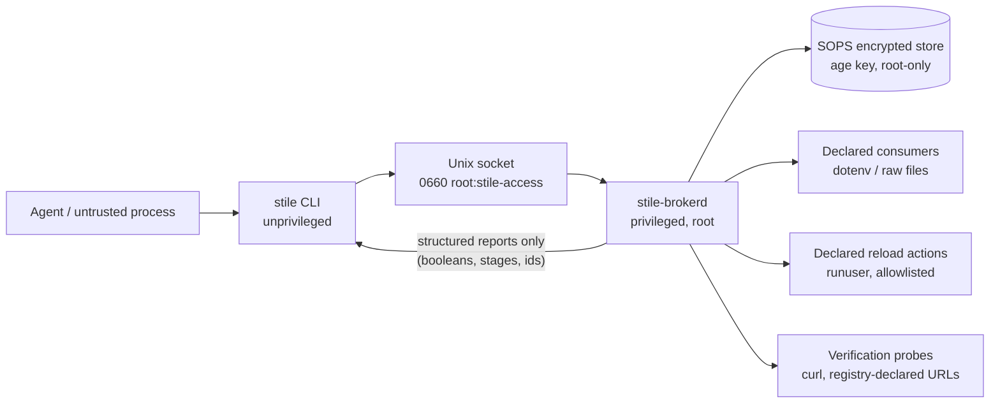

# stile

<p align="center">
  
</p>

**Give agents capabilities, not credentials.**

`stile` is a capability-oriented secret broker for Linux. It lets an
untrusted process — an AI coding agent, a CI job, a helper script —
perform narrowly defined **lifecycle operations** on secrets (rotate,
verify, reconcile, status, list) while the secret values themselves stay
behind a privilege boundary the caller cannot cross.

A stile is the structure in a fence or wall that lets people cross
without letting livestock through. Requests cross the boundary; secret
bytes do not come back.



Secret values flow from the encrypted store, through the privileged
broker, into the specific consumers, services and verification endpoints
declared in a root-owned registry. They never flow back to the client.

## Why

The usual way an AI agent works with credentials is: obtain the secret,
export it into the environment, run something. Every step widens the
blast radius — transcripts, logs, child processes, `.env` files, shell
history. "Just don't leak it" is not a control.

The Bad and the Better:

```text
BAD:   Agent → "give me the deploy token" → agent makes arbitrary requests
BETTER:Agent → stile rotate example-app/session-key
                → broker rotates, deploys, reloads, verifies
                → agent receives a structured report, never the token
```

Rotating a burned credential is exactly the operation an agent needs
after a suspected leak, and exactly the operation that must not require
seeing any secret. `stile` turns that into a narrow, auditable
capability.

Two caveats, stated plainly:

- Reducing credential **exposure** does not make a capability harmless.
  A caller who can rotate a secret holds real authority over it: they
  can force rotation (a denial-of-service against availability of the
  old value) and, for provider-assisted secrets, supply a replacement
  value they chose. Grant access only to callers you would trust with
  that much.
- This is a small, unaudited, early-stage project. It is **designed to**
  keep secrets away from untrusted callers; it does not *prove* anything.
  See [THREAT_MODEL.md](THREAT_MODEL.md) for the real boundary and its
  limits.

## What the broker does

The privileged daemon (`stile-brokerd`) owns every stage of a secret's
life, driven exclusively by a declarative, root-owned registry:

| Stage | What happens |
|---|---|
| Generate | Cryptographically secure hex/urlsafe value, broker memory only |
| Store | SOPS-encrypted update at the canonical repo path, atomic, fail-closed, with encrypted backups |
| Pre-reload hooks | e.g. `ALTER ROLE … PASSWORD …` piped via stdin to psql in the declared container (never argv) |
| Deploy | Update declared dotenv keys / raw files (owner + mode enforced) |
| Reload | Run only registry-declared commands as declared users via `runuser` |
| Verify | HTTP status probes; bearer probes attach credentials via a header file, never argv; optional old-credential revocation check |

Every operation returns a structured JSON report — stage names,
booleans, and identifiers. No field of any response can carry secret
bytes; the protocol types make such a field impossible to add by
accident (see `crates/stile-protocol`).

The unprivileged CLI (`stile`) has no code path that can receive or
print a secret value. There is deliberately no `get`, `show`, `reveal`,
`exec` or `export` command.

## Installation

From source (Rust 1.85+):

```console
$ git clone https://github.com/liamwh/stile
$ cd stile
$ cargo build --release --locked
# binaries: target/release/stile target/release/stile-brokerd
```

Or download a prebuilt binary from the GitHub releases page (Linux
x86_64/aarch64). Verify the checksum in `SHASUMS256.txt`.

## Setup

`stile` targets a single Linux host where secrets are already managed
with [SOPS](https://github.com/getsops/sops) (age-encrypted) inside a
git-tracked repository.

1. **Group** — create the access group; members may call lifecycle
   operations (they still never see values):

   ```console
   # groupadd --system stile-access
   # usermod -aG stile-access <agent-user>
   ```

2. **Broker identity** — a dedicated SOPS age identity, root-owned:

   ```console
   # age-keygen -o /etc/stile/age.key        # chmod 0400, add the public key to .sops.yaml
   ```

3. **Registry** — declare your secrets at
   `/etc/stile/registry.toml` (root-owned). See
   [examples/registry.toml](examples/registry.toml) and
   [docs/registry.md](docs/registry.md).

4. **Daemon config** — `/etc/stile/brokerd.toml` (root-owned). See
   [examples/brokerd.toml](examples/brokerd.toml).

5. **Service** — install the hardened systemd unit from
   [examples/stile-brokerd.service](examples/stile-brokerd.service):

   ```console
   # cp examples/stile-brokerd.service /etc/systemd/system/
   # systemctl enable --now stile-brokerd
   ```

## Example use

```console
$ stile list
example-app/session-key auto
example-app/provider-token provider-assisted

$ stile rotate example-app/session-key
{
  "status": "success",
  "operation": "rotate",
  "secret": "example-app/session-key",
  "store_updated": true,
  "runtime_updated": true,
  "services_reloaded": true,
  "verification_passed": true,
  "fingerprint_changed": true,
  "old_credential_revoked": true,
  "stages": [ { "stage": "store", "result": "ok", "detail": "sops updated" }, ... ]
}
```

For provider-issued credentials (e.g. an OAuth client secret that must
be reset in the provider's console), `stile status` shows the declared
human step, the user performs it at the provider, then:

```console
$ stile import-provider-secret example-app/provider-token
Paste the new provider secret for example-app/provider-token (input hidden, ends on Enter):
```

The value is read from the TTY with echo disabled and transits the
socket once; it is never in argv, environment, or a file.

## Security properties (design goals)

- The caller **cannot** request a secret value: the wire protocol has no
  such operation and rejects unknown operations, unknown fields, and
  oversized frames.
- The caller can invoke **only** registry-declared actions; the protocol
  has no execution primitive and the broker never builds commands from
  caller input.
- Peer authentication is `SO_PEERCRED`; authorisation is root, a UID
  allowlist, or membership in the access group (including supplementary
  groups).
- The socket is `0660 root:stile-access`; its parent directory is
  verified owner-matched and not world-writable before the broker
  starts.
- Every operation is audited (uid/gid/pid, operation, stages, duration)
  without ever recording values.
- Subprocess stderr is never forwarded to the caller.

These are enforced by construction where possible (type shapes, file
modes) and by simple, auditable checks elsewhere. They are goals and
engineering commitments, not formal guarantees.

## Non-goals

- Not a replacement for SOPS — SOPS remains the source of truth for
  encrypted material; stile is a runtime capability boundary around
  decrypted values.
- Not a secret *distribution* system for arbitrary hosts; consumers are
  local files and local services on one machine.
- Not protection against a compromised broker, compromised SOPS key
  material, a malicious kernel, or a malicious registry author — all of
  those are inside the trust boundary by definition.
- Not a side-channel defence; a caller that can observe the machine at
  privilege is out of scope.
- No Windows/macOS support; the boundary is Unix credentials and Unix
  sockets.

## SOPS integration

- The broker decrypts with a **dedicated, root-owned age identity**
  (`/etc/stile/age.key`, mode `0400`); the agent user has no access to
  any identity that can decrypt the stores.
- Writes happen at the canonical repo path (SOPS creation rules are
  path-relative). Sequence: refuse-if-plaintext guard → encrypted
  backup (kept 5, mode `0400`) → stage plaintext at `0600` with
  symlink-refusal → `sops encrypt --in-place` → decrypt-verify → restore
  the tracked file's original mode and owner. Any failure restores the
  previous encrypted bytes.
- If decryption fails, the operation errors; the store is untouched.
- After a rotation the repo contains new **encrypted** bytes only —
  commit and push it like any other change.

## Documentation

- [THREAT_MODEL.md](THREAT_MODEL.md) — assets, trust boundaries,
  attacker model, per-operation capability inventory, known risks
- [docs/architecture.md](docs/architecture.md)
- [docs/protocol.md](docs/protocol.md) — wire protocol reference
- [docs/registry.md](docs/registry.md) — declarative registry schema
- [docs/runbook.md](docs/runbook.md) — incident and operations procedures
- [SECURITY.md](SECURITY.md) — how to report vulnerabilities
- [CONTRIBUTING.md](CONTRIBUTING.md) — development and review rules

## Development

```console
$ cargo fmt
$ cargo clippy --all-targets --all-features -- -D warnings
$ CARGO_TARGET_DIR=target cargo build --all-targets
$ CARGO_TARGET_DIR=target cargo build --release -p stile -p stile-brokerd
$ cargo nextest run                # unit + end-to-end (42 tests)
```

The end-to-end suite runs the real broker against fake `sops`/`curl`/
`runuser` binaries with throwaway sentinel secrets and asserts
non-disclosure across every observable channel (responses, logs, audit
trail, argv, temp files).

## Project maturity

Early-stage, security-sensitive, and **not independently audited**.
Expect breaking changes across minor versions before 1.0. Read
[THREAT_MODEL.md](THREAT_MODEL.md) before trusting it with real
credentials.

## Licence

Apache-2.0. See [LICENSE](LICENSE).
