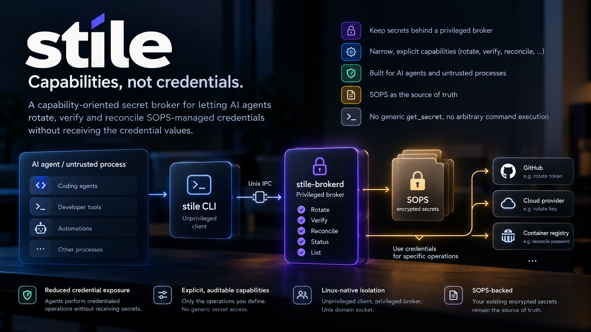
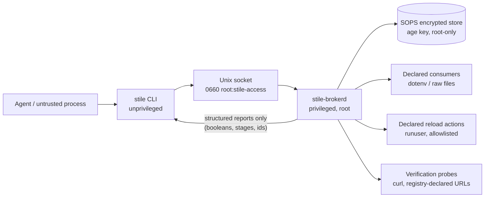

# stile

<p align="center">
  
</p>

**Give agents capabilities, not credentials.**

`stile` is a capability-oriented secret broker for Linux. It lets an
untrusted process — an AI coding agent, a CI job, a helper script —
perform narrowly defined **lifecycle operations** on secrets (rotate,
verify, reconcile, status, list) while the secret values themselves stay
behind a privilege boundary the caller cannot cross.

A stile is the structure in a fence or wall that lets people cross
without letting livestock through. Requests cross the boundary; secret
bytes do not come back.



Secret values flow from the encrypted store, through the privileged
broker, into the specific consumers, services and verification endpoints
declared in a root-owned registry. They never flow back to the client.

## Why

The usual way an AI agent works with credentials is: obtain the secret,
export it into the environment, run something. Every step widens the
blast radius — transcripts, logs, child processes, `.env` files, shell
history. "Just don't leak it" is not a control.

The Bad and the Better:

```text
BAD:   Agent → "give me the deploy token" → agent makes arbitrary requests
BETTER:Agent → stile rotate example-app/session-key
                → broker rotates, deploys, reloads, verifies
                → agent receives a structured report, never the token
```

Rotating a burned credential is exactly the operation an agent needs
after a suspected leak, and exactly the operation that must not require
seeing any secret. `stile` turns that into a narrow, auditable
capability.

Two caveats, stated plainly:

- Reducing credential **exposure** does not make a capability harmless.
  A caller who can rotate a secret holds real authority over it: they
  can force rotation (a denial-of-service against availability of the
  old value) and, for provider-assisted secrets, supply a replacement
  value they chose. Grant access only to callers you would trust with
  that much.
- This is a small, unaudited, early-stage project. It is **designed to**
  keep secrets away from untrusted callers; it does not *prove* anything.
  See [THREAT_MODEL.md](THREAT_MODEL.md) for the real boundary and its
  limits.

## What the broker does

The privileged daemon (`stile-brokerd`) owns every stage of a secret's
life, driven exclusively by a declarative, root-owned registry:

| Stage | What happens |
|---|---|
| Generate | Cryptographically secure hex/urlsafe value, broker memory only |
| Store | SOPS-encrypted update at the canonical repo path, atomic, fail-closed, with encrypted backups |
| Pre-reload hooks | e.g. `ALTER ROLE … PASSWORD …` piped via stdin to psql in the declared container (never argv) |
| Deploy | Update declared dotenv keys / raw files (owner + mode enforced) |
| Reload | Run only registry-declared commands as declared users via `runuser` |
| Verify | HTTP status probes; bearer probes attach credentials via a header file, never argv; optional old-credential revocation check |

Every operation returns a structured JSON report: stage names,
booleans, identifiers and a short message. No request type asks for a
value and no response field is meant to hold one. The report's two
free-text fields (`message` and each stage's `detail`) carry only
registry-declared identifiers, exit codes, fixed strings and parse
errors about the caller's own request. The end-to-end suite checks
responses, logs and argv for sentinel values on every run (see
`crates/stile-protocol` and `crates/integration`).

The unprivileged CLI (`stile`) has no code path that can receive or
print a secret value. There is deliberately no `get`, `show`, `reveal`,
`exec` or `export` command.

## Installing stile

Stile is **a privileged Linux service plus an unprivileged client**, not
a standalone CLI. A working deployment has four parts: the `stile`
client, the `stile-brokerd` system service, root-owned configuration
(the registry and the SOPS age identity), and an access group whose
members may call the broker. The channels below differ in how much of
that they assemble for you; the **broker configuration** steps at the
end are always yours.

Linux only, x86_64/aarch64.

### NixOS (recommended on NixOS hosts)

The repository ships a NixOS module that manages the service, the
`stile-access` group, runtime/state directories, the hardened unit and a
generated broker config:

```nix
{
  inputs.stile.url = "github:liamwh/stile";

  # in your NixOS configuration:
  imports = [ inputs.stile.nixosModules.stile ];

  services.stile = {
    enable = true;
    # optional overrides: accessGroup, socketPath, stateDir, sopsPackage,
    # extraReadWritePaths (SOPS repo root + consumer dirs)
  };
}
```

Or without flakes: add the channel, then
`imports = [ <stile>/nix/module.nix ];` and set
`services.stile.package`. The module **never** provisions the registry
or the age identity — continue with *Broker configuration* below.

Non-NixOS Nix users:

```console
$ nix profile install github:liamwh/stile    # both binaries
$ nix run github:liamwh/stile -- list
```

(this installs binaries only; the system integration is not managed).

### Debian / Ubuntu (recommended on conventional hosts)

Each release ships `stile_<version>_<arch>.deb` — a real system
package, not just binaries:

```console
$ sudo apt install ./stile_0.1.1_amd64.deb
```

That installs `/usr/bin/stile` and `/usr/bin/stile-brokerd`, the
hardened systemd unit, the `stile-access` group (via systemd-sysusers)
and state directories (via systemd-tmpfiles). The service is installed
**but not enabled**: it cannot work until you provide the registry and
the age identity, so the package refuses to pretend otherwise. Continue
with *Broker configuration* below.

### Manual / from GitHub Releases (canonical artefacts)

[GitHub Releases](https://github.com/liamwh/stile/releases) carry the
static musl binaries, `SHASUMS256.txt` and the `.deb`s — the source for
every other channel. For a manual deployment:

```console
$ curl -LO https://github.com/liamwh/stile/releases/download/v0.1.0/stile-v0.1.0-x86_64-unknown-linux-musl.tar.gz
$ sha256sum stile-v0.1.0-x86_64-unknown-linux-musl.tar.gz   # check SHASUMS256.txt
$ tar xzf stile-v0.1.0-*.tar.gz
# install -m755 stile-v0.1.0-*/stile stile-v0.1.0-*/stile-brokerd /usr/local/bin/
# usermod... see below
```

Copying the two binaries alone is **not** a stile deployment. Complete
steps:

```console
# 1. group whose members may call the broker
# groupadd --system stile-access
# usermod -aG stile-access <agent-user>

# 2. broker's SOPS age identity (root-only; public key joins .sops.yaml)
# age-keygen -o /etc/stile/age.key
# chmod 0400 /etc/stile/age.key

# 3. registry and daemon config (root-owned)
# install -m750 -d /etc/stile
# install -m640 examples/registry.toml /etc/stile/registry.toml   # then edit it
# install -m640 examples/brokerd.toml /etc/stile/brokerd.toml

# 4. systemd unit (adjust ReadWritePaths to your repo_root/consumers)
# install -m644 examples/stile-brokerd.service /etc/systemd/system/
# systemctl daemon-reload
# systemctl enable --now stile-brokerd

# 5. verify the boundary
$ stat -c '%a %U:%G %n' /run/stile/sock        # 660 root:stile-access
$ stile list                                    # from a member of stile-access
```

### Cargo (development / custom deployments)

The crates are published for Rust developers:

```console
$ cargo install stile --locked          # unprivileged client only
$ cargo install stile-brokerd --locked  # the daemon binary
```

`cargo install` places **binaries only**. It does not create the
systemd service, `/etc/stile`, runtime directories, the `stile-access`
group, socket ownership, a SOPS age identity, the registry, or any
service lifecycle — assembling those is what the NixOS module and the
`.deb` do. Use cargo for development, experimentation, unusual
deployment targets, or when you deliberately want to manage the system
integration yourself.

### Linuxbrew (developer convenience)

`brew install liamwh/stile/stile` on Linux installs the two binaries —
no service integration. Treat it as a client/development convenience,
not a deployment; macOS is not supported.

## Broker configuration (all installation methods)

Whichever channel you used, these remain the administrator's job — no
packaging may invent them:

1. **SOPS repository** — stile expects a git-tracked SOPS store
   (age-encrypted). The broker's age public key must be a recipient for
   the store files (`.sops.yaml`).
2. **Registry** — `/etc/stile/registry.toml`, root-owned: every secret,
   consumer, reload command and verification probe. See
   [examples/registry.toml](examples/registry.toml) and
   [docs/registry.md](docs/registry.md).
3. **Age identity** — `/etc/stile/age.key` (`0400`, root): the broker's
   decryption identity. Generate it with `age-keygen`; never commit it.
4. **Access group membership** — `usermod -aG stile-access <user>` for
   every agent user. Members may *request lifecycle operations*; they
   still never receive secret values.
5. **Enable and verify** — `systemctl enable --now stile-brokerd`, then
   `stat -c '%a %U:%G %n' /run/stile/sock` must show
   `660 root:stile-access`, and `stile list` must work from a member
   user and fail for a non-member.

The NixOS module and the `.deb` stop exactly at this line: they create
the *machinery*, you provide the *authority*.

## Example use

```console
$ stile list
{
  "status": "success",
  "operation": "list",
  ...
  "message": "example-app/db-password auto\nexample-app/email-encryption-key forbidden\nexample-app/inference-api-key auto\nexample-app/oauth-client-secret provider-assisted\nexample-app/session-key auto"
}

$ stile rotate example-app/email-encryption-key
{
  "status": "error",
  "operation": "rotate",
  "secret": "example-app/email-encryption-key",
  ...
  "message": "policy is forbidden (rotating would make stored email undecryptable; requires a migration) — rotation refused"
}

$ stile rotate example-app/session-key
{
  "status": "success",
  "operation": "rotate",
  "secret": "example-app/session-key",
  "store_updated": true,
  "runtime_updated": true,
  "services_reloaded": true,
  "verification_passed": true,
  "fingerprint_changed": true,
  "old_credential_revoked": true,
  "stages": [ { "stage": "store", "result": "ok", "detail": "sops updated" }, ... ]
}
```

For provider-issued credentials (e.g. an OAuth client secret that must
be reset in the provider's console), `stile status` shows the declared
human step, the user performs it at the provider, then:

```console
$ stile import-provider-secret example-app/provider-token
Paste the new provider secret for example-app/provider-token (input hidden, ends on Enter):
```

The value is read from the TTY with echo disabled and transits the
socket once; it is never in argv, environment, or a file.

## Security properties (design goals)

- The caller **cannot** request a secret value: the wire protocol has no
  such operation and rejects unknown operations, unknown fields, and
  oversized frames.
- The caller can invoke **only** registry-declared actions; the protocol
  has no execution primitive and the broker never builds commands from
  caller input.
- Peer authentication is `SO_PEERCRED`; authorisation is root, a UID
  allowlist, or membership in the access group (including supplementary
  groups).
- The socket is `0660 root:stile-access`; its parent directory is
  verified owner-matched and not world-writable before the broker
  starts.
- Every rotate, verify, reconcile and import is audited (uid/gid/pid,
  operation, stages, duration), including attempts the registry policy
  refuses, without ever recording values. Read-only `status` and `list`
  are not.
- Subprocess stderr is never forwarded to the caller.

These are enforced by construction where possible (type shapes, file
modes) and by simple, auditable checks elsewhere. They are goals and
engineering commitments, not formal guarantees.

## Non-goals

- Not a replacement for SOPS — SOPS remains the source of truth for
  encrypted material; stile is a runtime capability boundary around
  decrypted values.
- Not a secret *distribution* system for arbitrary hosts; consumers are
  local files and local services on one machine.
- Not protection against a compromised broker, compromised SOPS key
  material, a malicious kernel, or a malicious registry author — all of
  those are inside the trust boundary by definition.
- Not a side-channel defence; a caller that can observe the machine at
  privilege is out of scope.
- No Windows/macOS support; the boundary is Unix credentials and Unix
  sockets.

## SOPS integration

- The broker decrypts with a **dedicated, root-owned age identity**
  (`/etc/stile/age.key`, mode `0400`); the agent user has no access to
  any identity that can decrypt the stores.
- Writes happen at the canonical repo path (SOPS creation rules are
  path-relative). Sequence: refuse-if-plaintext guard → encrypted
  backup (kept 5, mode `0400`) → stage plaintext at `0600` with
  symlink-refusal → `sops encrypt --in-place` → decrypt-verify → restore
  the tracked file's original mode and owner. Any failure restores the
  previous encrypted bytes.
- If decryption fails, the operation errors; the store is untouched.
- After a rotation the repo contains new **encrypted** bytes only —
  commit and push it like any other change.

## Documentation

- [THREAT_MODEL.md](THREAT_MODEL.md) — assets, trust boundaries,
  attacker model, per-operation capability inventory, known risks
- [docs/architecture.md](docs/architecture.md)
- [docs/protocol.md](docs/protocol.md) — wire protocol reference
- [docs/registry.md](docs/registry.md) — declarative registry schema
- [docs/runbook.md](docs/runbook.md) — incident and operations procedures
- [SECURITY.md](SECURITY.md) — how to report vulnerabilities
- [CONTRIBUTING.md](CONTRIBUTING.md) — development and review rules

## Development

```console
$ cargo fmt
$ cargo clippy --all-targets --all-features -- -D warnings
$ CARGO_TARGET_DIR=target cargo build --all-targets
$ CARGO_TARGET_DIR=target cargo build --release -p stile -p stile-brokerd
$ cargo nextest run                # unit + end-to-end (42 tests)
```

The end-to-end suite runs the real broker against fake `sops`/`curl`/
`runuser` binaries with throwaway sentinel secrets and asserts
non-disclosure across every observable channel (responses, logs, audit
trail, argv, temp files).

## Project maturity

Early-stage, security-sensitive, and **not independently audited**.
Expect breaking changes across minor versions before 1.0. Read
[THREAT_MODEL.md](THREAT_MODEL.md) before trusting it with real
credentials.

## Licence

Apache-2.0. See [LICENSE](LICENSE).
